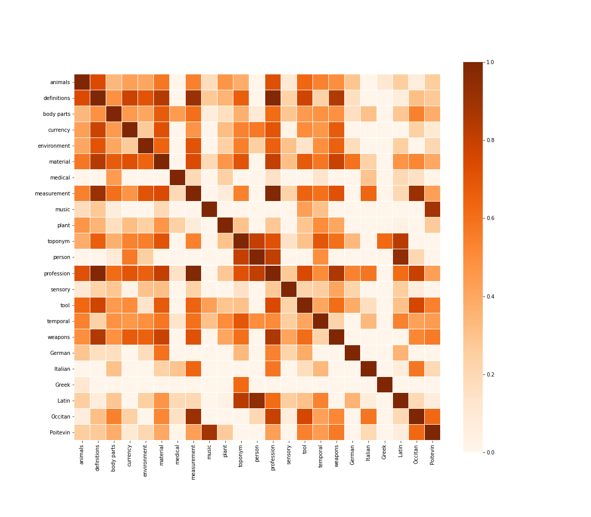
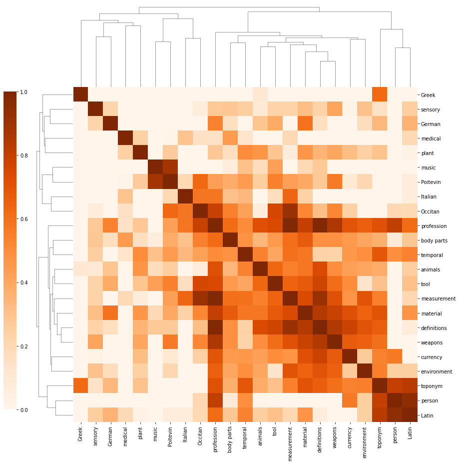
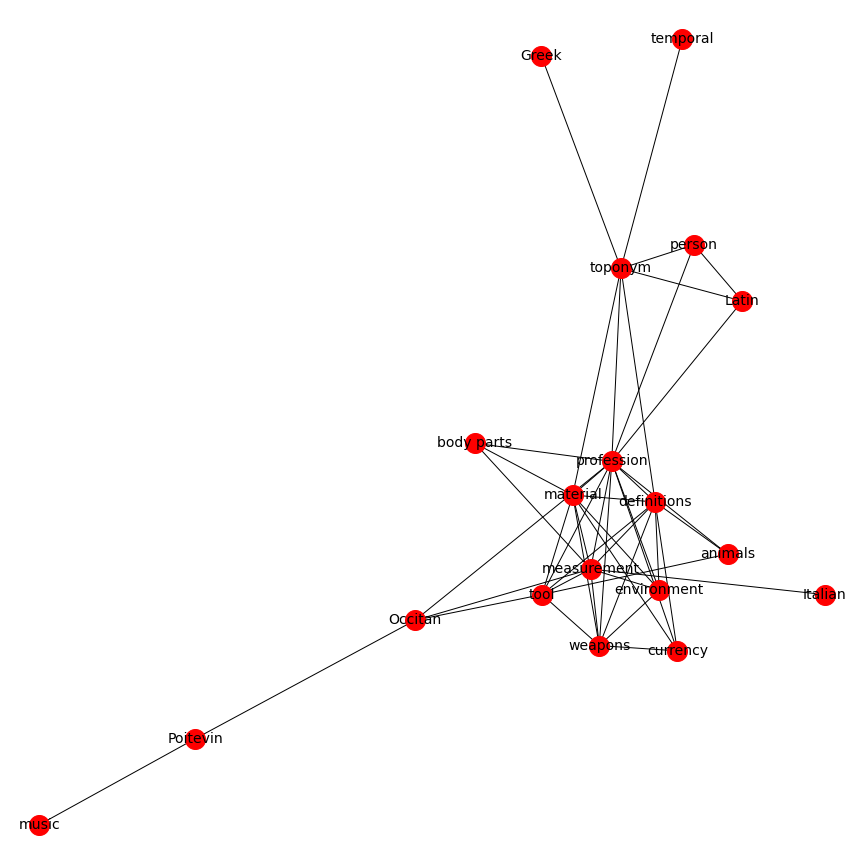
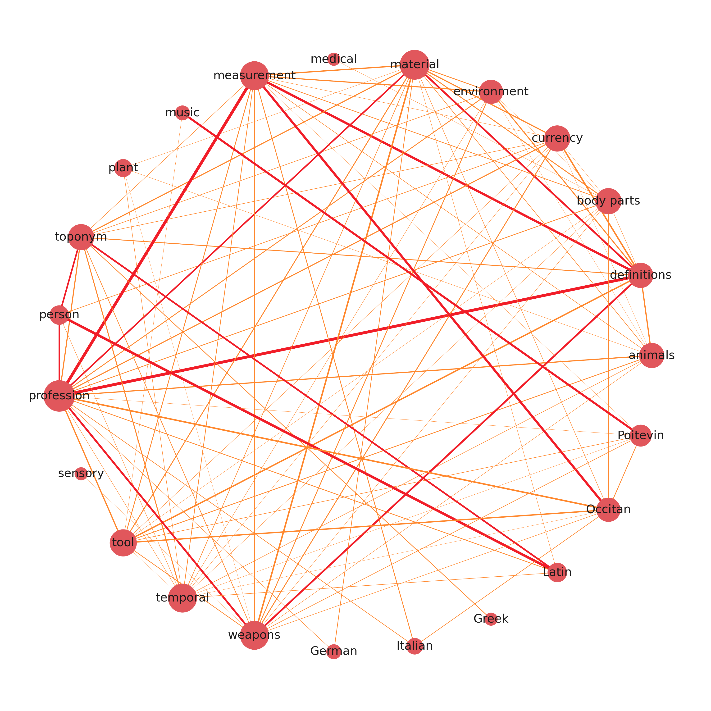

# Overview 
Data-rich scholarly editions contain valuable editorial annotations one can extract, analyze, and visualize for all sorts of scholarly purposes. This is the case of [*Secrets of Craft and Nature in Renaissance France*](https://edition640.makingandknowing.org), released in 2020, and which makes its metadata file available to download from its GitHub repository. In this post, I show how to gather all these variables in a correlation matrix and visualize them in different ways.

# The data
The Making and Knowing Project generates a spreadsheet containing updated information about the manuscript's contents: ```entry_metadata.csv```. The file can be retrieved from the Making & Knowing [GitHub repository](https://github.com/cu-mkp/m-k-manuscript-data/blob/master/metadata/entry_metadata.csv). Alternatively, one can generate tailored .csv files, addidng more markup thanks to Matthew Kumar's excellent [manuscript-object](https://github.com/cu-mkp/manuscript-object), a Python version of BnF Ms. Fr. 640.

## Setting up Python 
We'll use Pandas for data wrangling, Matplotlib and seaborn for the heatmaps, and finally NetworkX to produce a correlation-based networks.  
For this type of variables, we'll avoid the Pearson method, and use instead the 𝜙𝐾 method. Make sure you [read about](https://phik.readthedocs.io/en/latest/index.html) this correlation method and `PhiK`, its corresponding library.

```python
#install packages
pip install phik

# import modules
import pandas as pd
import matplotlib.pyplot as plt
import seaborn as sns
import networkx as nx
```

## Prepare the data
First, let's download the edition's latest metadata file from their [GitHub repository](https://github.com/cu-mkp/m-k-manuscript-data) in the metadata folder.
We'll select only the columns we need. For this demonstration, I choose all the semantic tags from the English translation `tl`, but you can also choose tags from the French transcription `tc`, or the normalized version `tcn`. 
The data comes into semicolon-separated values, and we need Python to count them for us. So we'll use the stack-unstack method to do so with the regular expression `[^;\s][^\;]*[^;\s]*`.
To make the matrix more accessible, we rename each column. You can skip this step if you're in a rush, just bear in mind that our dataframe, at this stage is named `tagsrn`.

```python
# load the edition's metadata
df = pd.read_csv('entry_metadata.csv')

# select the tags you want to correlate
dftags = df[['al_tl', 'bp_tl', 'cn_tl', 'df_tl', 'env_tl', 'm_tl', 'md_tl', 'ms_tl', 'mu_tl', 'pa_tl', 'pl_tl', 'pn_tl', 'pro_tl', 'sn_tl', 'tl_tl', 'tmp_tl', 'wp_tl', 'de_tl', 'el_tl', 'it_tl', 'la_tl', 'oc_tl', 'po_tl']]

# count comma separated values
tagcount = dftags.stack(dropna=False).str.count(r'[^;\s][^\;]*[^;\s]*').unstack()

# rename columns
tagsrn = tagcount.rename(columns={'al_tl': 'animals', 'bp_tl': 'body parts', 'cn_tl': 'currency', 'df_tl': 'definitions', 'env_tl': 'environment', 'm_tl': 'material', 'md_tl': 'medical', 'ms_tl': 'measurement', 'mu_tl': 'music', 'pa_tl': 'plant', 'pl_tl': 'toponym', 'pn_tl': 'person', 'pro_tl': 'profession', 'sn_tl': 'sensory', 'tl_tl': 'tool', 'tmp_tl': 'temporal', 'wp_tl': 'weapons', 'de_tl': 'German', 'el_tl': 'Greek', 'it_tl': 'Italian', 'la_tl': 'Italian', 'oc_tl': 'Occitan', 'po_tl': 'Poitevin'})
```

# Correlate

Once the dataframe is clean, we can move on to calculate the correlation coefficients between each variables. It's important at this stage to understand your data, and to make sure you use the most appropriate correlation method. The package `pandas-profiling` is particularly helpful for this task. 

```python
# calculate correlation coefficient with the phi k method
cortag = tagsrn.phik_matrix()
```
`cortag` is our correlation matrix. We can now try different types of visualization.

# Visualize
The first thing we can try is to visualize it as a color-encoded matrix, using the [heatmap module](https://seaborn.pydata.org/generated/seaborn.heatmap.html) from `seaborn`. 

### Correlation heatmap
```python
f, ax = plt.subplots(figsize=(16, 14))
ax = sns.heatmap(cortag, linewidths=.03, vmin=0, cmap="Oranges", square=True)
```


If you know the text well, you can immediately see that the heatmap makes a lot of sense. For example, names are strongly correlated to Latin, as it was customary, especially among 16th-century humanists, to Latinize them.  

Some people may argue that this heatmap is merely stating the obvious. They are not entirely wrong, and at first sight, medical tags look like a case in point, as they predictably correlate with body parts, measurements and plants.

But if we read the heatmap more carefully, line by line, we may find some interesting and unexpected correlations. That medical tags, for example, are correlated with Italian and Latin words, gives us some clues about the origin of medical recipes in Ms. Fr. 640. Similarly, the correlation between professions, definitions, and measurements, shows the extent to which professional identity structures 16th-century technical discourses. 

### Correlation Clustermap

Heatmaps are helpful in "exploratory" contexts, but they may look a bit messy to your audience, especially if you're discussing–or still looking for–specific semantic clusters in the manuscript. Seaborn's `clustermap` module may offer interesting results.

```python
clustermap = sns.clustermap(cortag, figsize=(12, 13), dendrogram_ratio=(.1, .2), vmin=0, cmap="Oranges", cbar_pos=(-.06, .12, .03, .68))
```


Besides looking like a pixelated (yes, it's on the OED) insect, the clustermap clearly distinguishes isolated tags (on the top and left) from those that are more interconnected. We also distinguish isolated clusters, such as music and Poitevin (who would have thought!), from more central ones such as mesaurement, material, definitions and weapons. Professions are more interconnected, but they're not part, at least in this specific correlation matrix, of a particular cluster.

### Correlation network

If we want to synthesize even more the correlations contained in our matrix, network graphs offer an elegant solution. This is particularly true in contexts where we want to communicate about the manuscript's contents.  
In order to do this, we need to change our matrix into a list of edges and nodes and define a threshold to eliminate weaker correlations from our graph.

```python
# transform the data
links = cortag.stack().reset_index()
links.columns = ['var1', 'var2','value']

# threshold 
links_filtered = links.loc[(links['value'] > .6) & (links['var1'] != links['var2'])]
links_filtered

# create edges
G = nx.from_pandas_edgelist(links_filtered, 'var1', 'var2')

# draw network using Kamada & Kawai's algorithm 
plt.figure(3,figsize = (12,12)) 
nx.draw_kamada_kawai(G, with_labels = True, node_color = 'red', node_size = 400, edge_color = 'black', linewidths = 1, font_size = 14)
```


If there are too many edges and nodes, you can still change the threshold to get a cleaner result. Otherwise, you can export the graph to play with it in `Gephi`, using the function `.write_gexf()`.

```python 
nx.write_gexf(G, 'graph.gexf')
``` 
You can see the result at the beginning of this post.


### Update: Circular weighted network

I was looking for ways to display correlation matrices as weighted networks, and I found this interesting approach [shared by Julian West](https://julian-west.github.io/blog/visualising-asset-price-correlations/#remove-edges-below-a-threshold), which I am adapting here to our dataset.

```python
# create graph weighted by correlation coefficients (unfiltered)
Gx = nx.from_pandas_edgelist(links, 'var1', 'var2', edge_attr=['value'])

# determine a threshold to remove some edges
threshold = 0.4

# list to store edges to remove
remove = []

# loop through edges in Gx and find correlations which are below the threshold
for var1, var2 in Gx.edges():
    corr = Gx[var1][var2]['value']
    #add to remove node list if abs(corr) < threshold
    if abs(corr) < threshold:
        remove.append((var1, var2))

# remove edges contained in the remove list
Gx.remove_edges_from(remove)

print(str(len(remove)) + ' edges removed')
```
Once we remove a few edges, we can determine their color and thickness.

```python
# determine the colors of edges
def assign_colour(correlation):
    if correlation <= 0.8:
        return '#ff872c'  # orange
    else:
        return '#f11d28'  # red


def assign_thickness(correlation, benchmark_thickness=3, scaling_factor=3):
    return benchmark_thickness * abs(correlation)**scaling_factor


def assign_node_size(degree, scaling_factor=50):
    return degree * scaling_factor
```

We also give nodes a size proportional to their number of connections. 

```python
# assign node size depending on number of connections (degree)
node_size = []
for key, value in dict(Gx.degree).items():
    node_size.append(assign_node_size(value))
```
The result is a weighted graph that admits more nodes and considerably more edges, while remaining readable and informative. 

 