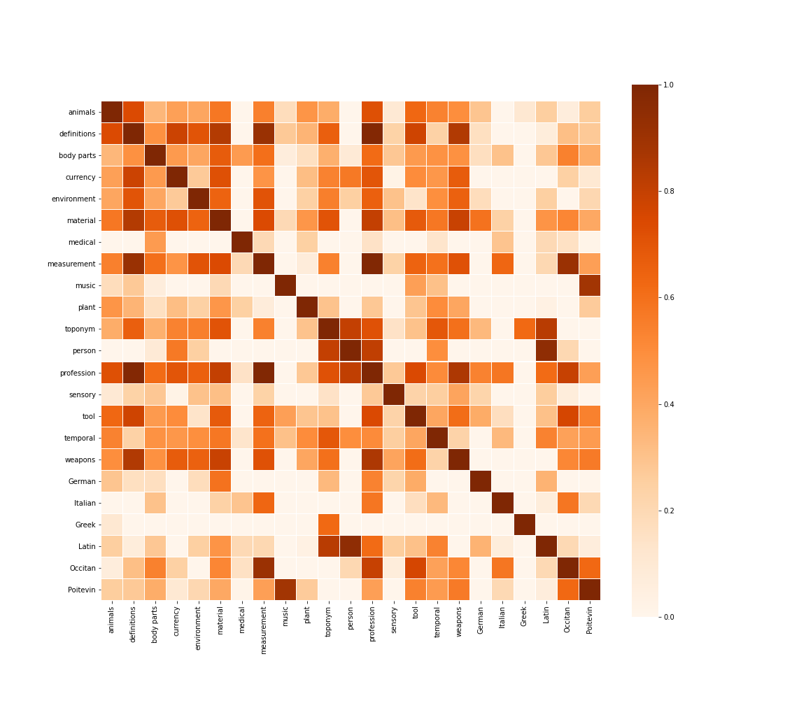
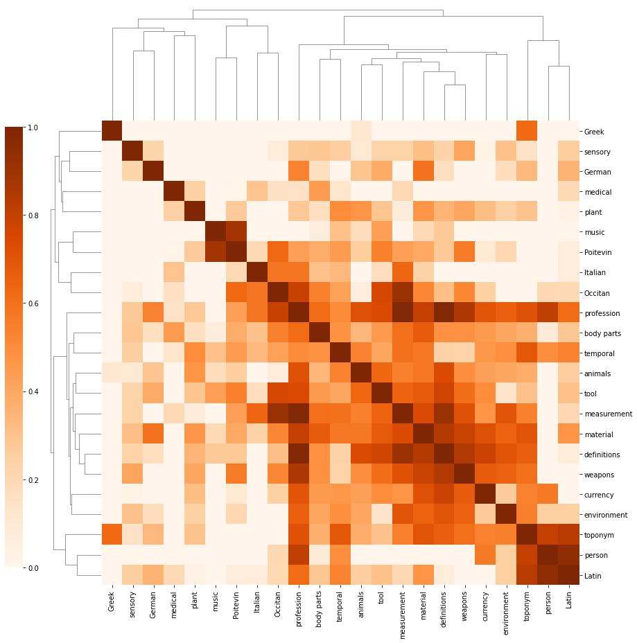
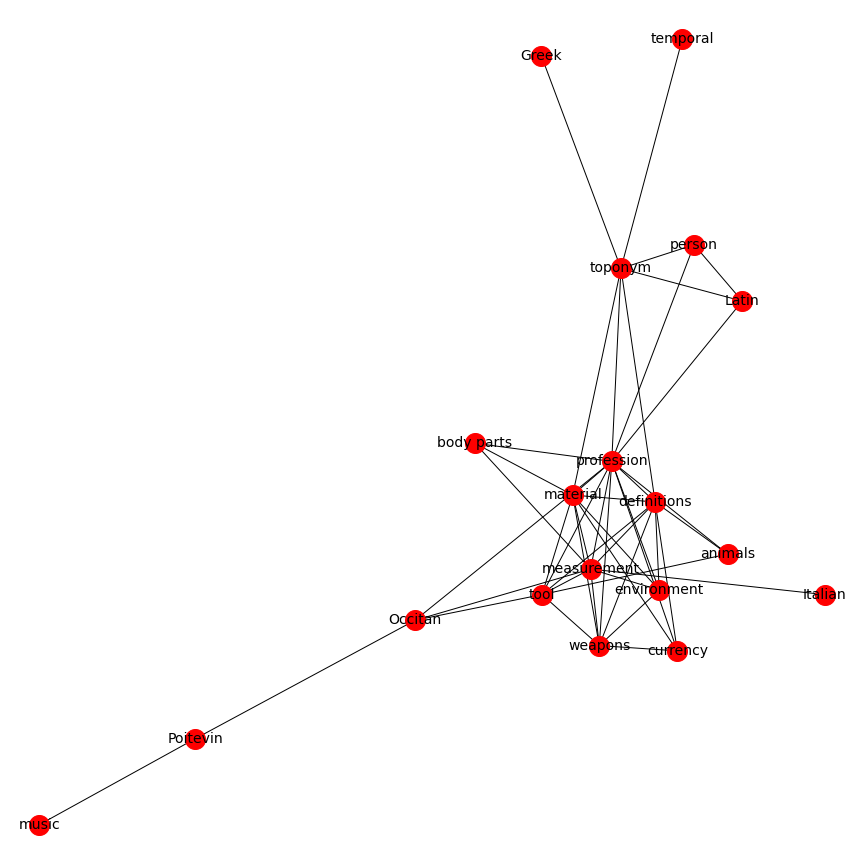
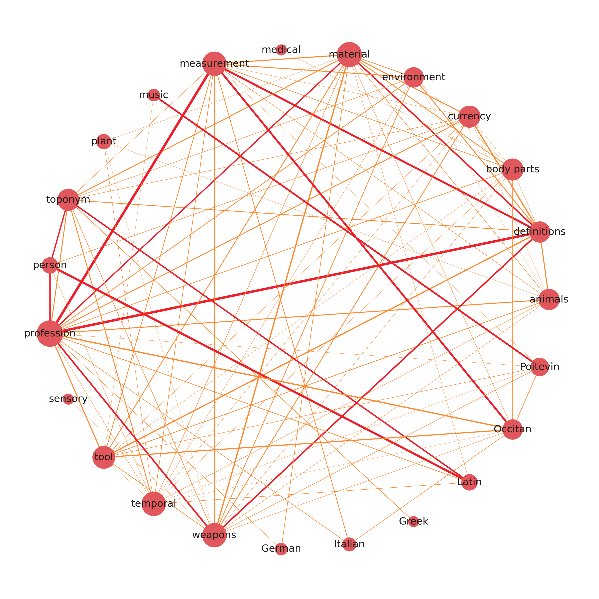

# Panorâmica 
As edições académicas ricas em dados contêm anotações editoriais valiosas que se podem extrair, analisar e visualizar para toda a espécie de fins académicos. É o caso de [*Secrets of Craft and Nature in Renaissance France*](https://edition640.makingandknowing.org), lançada em 2020, que disponibiliza o seu ficheiro de metadados para descarga no seu repositório GitHub. Neste artigo, mostro como reunir todas estas variáveis numa matriz de correlação e visualizá-las de diferentes maneiras.

# Os dados
O Making and Knowing Project gera uma folha de cálculo com informação atualizada sobre o conteúdo do manuscrito: ```entry_metadata.csv```. O ficheiro pode ser obtido no [repositório GitHub](https://github.com/cu-mkp/m-k-manuscript-data/blob/master/metadata/entry_metadata.csv) do Making & Knowing. Em alternativa, podem gerar-se ficheiros .csv à medida, com mais marcação, graças ao excelente [manuscript-object](https://github.com/cu-mkp/manuscript-object) de Matthew Kumar, uma versão em Python do BnF Ms. Fr. 640.

## Preparar o Python 
Usaremos o Pandas para tratar os dados, o Matplotlib e o seaborn para os mapas de calor e, por fim, o NetworkX para produzir redes baseadas em correlações.  
Para este tipo de variáveis, evitaremos o método de Pearson e usaremos em seu lugar o método 𝜙𝐾. Convém [ler sobre](https://phik.readthedocs.io/en/latest/index.html) este método de correlação e sobre o `PhiK`, a biblioteca correspondente.

```python
#install packages
pip install phik

# import modules
import pandas as pd
import matplotlib.pyplot as plt
import seaborn as sns
import networkx as nx
```

## Preparar os dados
Comecemos por descarregar o ficheiro de metadados mais recente da edição, na pasta metadata do seu [repositório GitHub](https://github.com/cu-mkp/m-k-manuscript-data).
Selecionaremos apenas as colunas de que precisamos. Para esta demonstração, escolho todas as etiquetas semânticas da tradução inglesa `tl`, mas também se podem escolher as da transcrição francesa `tc` ou as da versão normalizada `tcn`. 
Os dados vêm em valores separados por ponto e vírgula, e precisamos que o Python os conte por nós. Usaremos para isso o método stack-unstack com a expressão regular `[^;\s][^\;]*[^;\s]*`.
Para tornar a matriz mais legível, mudamos o nome a cada coluna. Quem tiver pressa pode saltar este passo; basta ter presente que, nesta altura, o nosso dataframe se chama `tagsrn`.

```python
# load the edition's metadata
df = pd.read_csv('entry_metadata.csv')

# select the tags you want to correlate
dftags = df[['al_tl', 'bp_tl', 'cn_tl', 'df_tl', 'env_tl', 'm_tl', 'md_tl', 'ms_tl', 'mu_tl', 'pa_tl', 'pl_tl', 'pn_tl', 'pro_tl', 'sn_tl', 'tl_tl', 'tmp_tl', 'wp_tl', 'de_tl', 'el_tl', 'it_tl', 'la_tl', 'oc_tl', 'po_tl']]

# count comma separated values
tagcount = dftags.stack(dropna=False).str.count(r'[^;\s][^\;]*[^;\s]*').unstack()

# rename columns
tagsrn = tagcount.rename(columns={'al_tl': 'animals', 'bp_tl': 'body parts', 'cn_tl': 'currency', 'df_tl': 'definitions', 'env_tl': 'environment', 'm_tl': 'material', 'md_tl': 'medical', 'ms_tl': 'measurement', 'mu_tl': 'music', 'pa_tl': 'plant', 'pl_tl': 'toponym', 'pn_tl': 'person', 'pro_tl': 'profession', 'sn_tl': 'sensory', 'tl_tl': 'tool', 'tmp_tl': 'temporal', 'wp_tl': 'weapons', 'de_tl': 'German', 'el_tl': 'Greek', 'it_tl': 'Italian', 'la_tl': 'Italian', 'oc_tl': 'Occitan', 'po_tl': 'Poitevin'})
```

# Correlacionar

Limpo o dataframe, podemos passar ao cálculo dos coeficientes de correlação entre cada par de variáveis. Nesta fase, é importante compreender os dados e garantir que se usa o método de correlação mais adequado. O pacote `pandas-profiling` é particularmente útil para isso. 

```python
# calculate correlation coefficient with the phi k method
cortag = tagsrn.phik_matrix()
```
`cortag` é a nossa matriz de correlação. Podemos agora experimentar diferentes tipos de visualização.

# Visualizar
A primeira coisa a tentar é visualizá-la como matriz codificada por cores, com o [módulo heatmap](https://seaborn.pydata.org/generated/seaborn.heatmap.html) do `seaborn`. 

### Mapa de calor de correlações
```python
f, ax = plt.subplots(figsize=(16, 14))
ax = sns.heatmap(cortag, linewidths=.03, vmin=0, cmap="Oranges", square=True)
```


Quem conhece bem o texto vê logo que o mapa de calor faz muito sentido. Os nomes, por exemplo, estão fortemente correlacionados com o latim, pois era costume, sobretudo entre os humanistas do século XVI, latinizá-los.  

Haverá quem diga que este mapa de calor se limita a afirmar o óbvio. Não estão inteiramente errados e, à primeira vista, as etiquetas médicas parecem confirmá-lo, pois correlacionam-se, como seria de prever, com partes do corpo, medidas e plantas.

Mas, se lermos o mapa de calor com mais atenção, linha a linha, podemos encontrar correlações interessantes e inesperadas. Que as etiquetas médicas, por exemplo, se correlacionem com palavras italianas e latinas dá-nos pistas sobre a origem das receitas médicas do Ms. Fr. 640. Do mesmo modo, a correlação entre profissões, definições e medidas mostra até que ponto a identidade profissional estrutura os discursos técnicos do século XVI. 

### Mapa de agrupamentos (clustermap)

Os mapas de calor são úteis em contextos «exploratórios», mas podem parecer um pouco confusos ao público, sobretudo quando se discutem – ou ainda se procuram – agrupamentos semânticos específicos no manuscrito. O módulo `clustermap` do seaborn pode dar resultados interessantes.

```python
clustermap = sns.clustermap(cortag, figsize=(12, 13), dendrogram_ratio=(.1, .2), vmin=0, cmap="Oranges", cbar_pos=(-.06, .12, .03, .68))
```


Além de parecer um inseto pixelizado (sim, a palavra está dicionarizada), o clustermap distingue claramente as etiquetas isoladas (em cima e à esquerda) das mais interligadas. Distinguem-se também agrupamentos isolados, como música e poitevin (quem diria!), de outros mais centrais, como medidas, material, definições e armas. As profissões estão mais interligadas, mas não fazem parte, pelo menos nesta matriz de correlação, de nenhum agrupamento em particular.

### Rede de correlações

Se quisermos sintetizar ainda mais as correlações contidas na matriz, os grafos de rede oferecem uma solução elegante. Isto é particularmente verdade nos contextos em que queremos comunicar sobre o conteúdo do manuscrito.  
Para o fazer, é preciso transformar a matriz numa lista de arestas e nós e definir um limiar que elimine do grafo as correlações mais fracas.

```python
# transform the data
links = cortag.stack().reset_index()
links.columns = ['var1', 'var2','value']

# threshold 
links_filtered = links.loc[(links['value'] > .6) & (links['var1'] != links['var2'])]
links_filtered

# create edges
G = nx.from_pandas_edgelist(links_filtered, 'var1', 'var2')

# draw network using Kamada & Kawai's algorithm 
plt.figure(3,figsize = (12,12)) 
nx.draw_kamada_kawai(G, with_labels = True, node_color = 'red', node_size = 400, edge_color = 'black', linewidths = 1, font_size = 14)
```


Se houver arestas e nós a mais, pode sempre alterar-se o limiar para obter um resultado mais limpo. Em alternativa, pode exportar-se o grafo para o manipular no `Gephi`, com a função `.write_gexf()`.

```python 
nx.write_gexf(G, 'graph.gexf')
``` 
O resultado pode ver-se no início deste artigo.


### Atualização: rede ponderada circular

Andava à procura de maneiras de representar matrizes de correlação como redes ponderadas e encontrei esta abordagem interessante [partilhada por Julian West](https://julian-west.github.io/blog/visualising-asset-price-correlations/#remove-edges-below-a-threshold), que adapto aqui ao nosso conjunto de dados.

```python
# create graph weighted by correlation coefficients (unfiltered)
Gx = nx.from_pandas_edgelist(links, 'var1', 'var2', edge_attr=['value'])

# determine a threshold to remove some edges
threshold = 0.4

# list to store edges to remove
remove = []

# loop through edges in Gx and find correlations which are below the threshold
for var1, var2 in Gx.edges():
    corr = Gx[var1][var2]['value']
    #add to remove node list if abs(corr) < threshold
    if abs(corr) < threshold:
        remove.append((var1, var2))

# remove edges contained in the remove list
Gx.remove_edges_from(remove)

print(str(len(remove)) + ' edges removed')
```
Removidas algumas arestas, podemos determinar a cor e a espessura das restantes.

```python
# determine the colors of edges
def assign_colour(correlation):
    if correlation <= 0.8:
        return '#ff872c'  # orange
    else:
        return '#f11d28'  # red


def assign_thickness(correlation, benchmark_thickness=3, scaling_factor=3):
    return benchmark_thickness * abs(correlation)**scaling_factor


def assign_node_size(degree, scaling_factor=50):
    return degree * scaling_factor
```

Damos também aos nós um tamanho proporcional ao seu número de ligações. 

```python
# assign node size depending on number of connections (degree)
node_size = []
for key, value in dict(Gx.degree).items():
    node_size.append(assign_node_size(value))
```
O resultado é um grafo ponderado que admite mais nós e consideravelmente mais arestas, sem deixar de ser legível e informativo. 

 